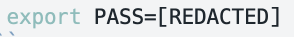

# leafblind

> **Blinded by a leaf.** — 一叶障目，不见泰山。

A pi-agent extension that redacts access tokens, passwords, private keys, and
environment variable values from all LLM API requests using deterministic regex
matching — while preserving variable names.

Designed for and tested on [pi-agent](https://github.com/earendil-works/pi-coding-agent) ≥ 0.80.2.

**Why this exists:** the assumption is that an LLM agent only needs
environment variable **names** to reason about configuration — never their
actual values. This extension redacts all values to `[REDACTED]` before they
reach the model, while preserving variable names and declaration syntax.

[中文文档](README.zh.md)

## Screenshots

**Without leafblind** — the LLM sees and repeats raw credentials:


**With leafblind** — values are redacted to `[REDACTED]`, variable names preserved:



---

## Installation

Add `extensions` in pi's `settings.json` pointing to your clone of this
repo:

```json
{
  "extensions": ["<path-to-cloned-repo>"]
}
```

Or symlink/copy this directory into `~/.pi/agent/extensions/leafblind/` (pi
auto-discovers `extensions/*/index.ts`).

## Mechanism

- Hooks the `context` event (model-agnostic, fires before every LLM call,
  prior to `convertToLlm`).
- Hooks the `before_provider_request` event to catch tool results in
  streaming providers.
- `redact()` is a deterministic pure function: same input → same output,
  fixed placeholder `[REDACTED]` — does not break prompt cache prefix.
- **Syntax-driven, redact-all-values**: every environment-variable
  declaration has its VALUE replaced with `[REDACTED]`; the variable name and
  declaration keyword (`export`/`declare`/`set`/etc.) are preserved.
  Sensitivity is NOT decided by the variable name.
- Variable name preserved: `export VAR=sk-xxx` → `export VAR=[REDACTED]`.
- Known token formats (AWS/OpenAI/GitHub/Slack/JWT/Bearer) and PEM private
  key blocks are replaced in their entirety.
- Command options (`--opt=val`), JSON keys, and function arguments
  (`func(arg=val)`) are NOT declarations and are left untouched.
- Multi-line PEM private key blocks are fully replaced.
- Email / phone numbers / general PII are NOT matched.

## Coverage

### Environment Variable Declaration Syntaxes (value redacted, name kept)

| Syntax | Example |
|--------|---------|
| `export VAR=val` | `export PASS_ZTE=xxx` |
| Bare `VAR=val` (line start / after `;` `&`) | `PASS_ZTE=xxx` |
| `VAR: val` (YAML / colon) | `wifi_pass: xxx` |
| `declare -x VAR=val` | `declare -x SECRET=xxx` |
| `env VAR=val cmd` | `env API_KEY=xxx cmd` |
| `set VAR=val` (Windows) | `set DB_PASS=xxx` |
| `$env:VAR = "val"` (PowerShell) | `$env:TOKEN = "xxx"` |
| `set -x VAR val` (fish) | `set -x MY_PWD xxx` |
| `os.environ["VAR"] = "val"` (Python) | `os.environ["PSK"] = "xxx"` |

### Token Formats (whole match replaced)

Known token formats — including AWS access keys, OpenAI keys, GitHub tokens,
Slack tokens, JWTs, Bearer tokens, and PEM private key blocks — are matched
via regex and replaced in their entirety with `[REDACTED]`.

## Performance

1 MB text filtering ≤ 50 ms (measured: 8 ms with 50 secrets / 4 ms
without secrets).

## Testing

```bash
node --experimental-strip-types --test leafblind.test.mjs
node --experimental-strip-types --test leafblind.integration.test.mjs
```

73 test cases, all using purely fictional placeholder values (marked
`fake`/`test`). No real secrets.
